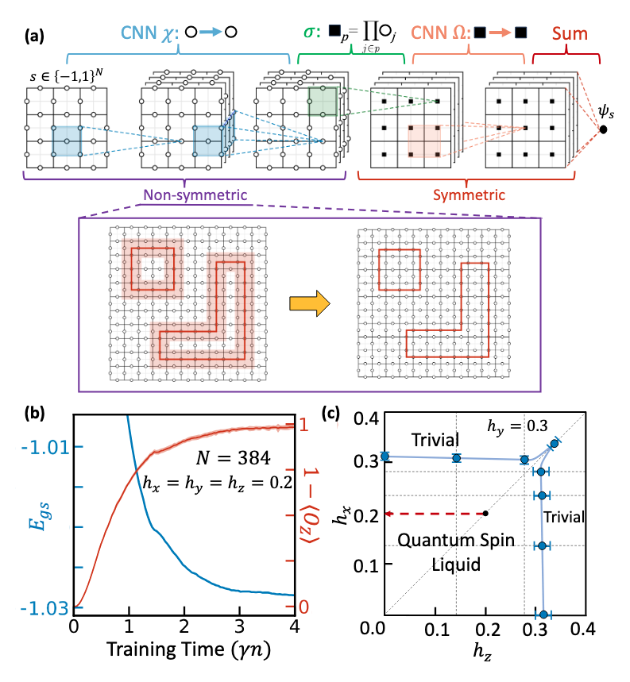

# Approximately-symmetric neural quantum states for quantum spin liquids

Implementation of *[Phys. Rev. Lett. 135, 056702 (Editor's Suggestion)](https://journals.aps.org/prl/abstract/10.1103/pgnx-11ph)*

See also [arXiv version](https://arxiv.org/pdf/2405.17541) for open-access.

This repository contains code for simulating quantum spin liquids, particularly the mixed-field toric code model, using approximately-symmetric neural network quantum states (NQS). The implementation demonstrates competitive performance with state-of-the-art tensor network and quantum Monte Carlo methods, while enabling exploration of Hamiltonians with sign problems beyond the reach of traditional methods.



*See Fig. 1 in [arXiv:2405.17541](https://arxiv.org/pdf/2405.17541)*

## Overview

Quantum spin liquids represent exotic phases of strongly-correlated matter exhibiting long-range entanglement and fractionalization. This code implements approximately-symmetric neural networks that are parameter-efficient, scalable, and outperform existing symmetry-unaware neural network architectures. The network comprises an exactly symmetric block following a non-symmetric block, which learns a transformation of the ground state analogous to quasiadiabatic continuation.

The implementation uses:
- JAX for automatic differentiation and GPU acceleration
- NetKet for quantum many-body simulations
- Flax for building neural network architectures

## Features

- Approximately-symmetric neural network architecture with:
  - Non-symmetric block for learning quasiadiabatic continuation
  - Exactly symmetric block for enforcing physical symmetries
- Support for open (OBC) boundary conditions (PBC need a bit more work, but follow a similar format)
- Two neural network architectures: "Combo" and "RPP" (see the paper)
- Calculation of various observables: Wilson loops, magnetization, Renyi entropy, 2-point correlators
- GPU acceleration for faster simulations
- Advanced MCMC sampling with vertex updates for improved efficiency
- Real and complex neural network quantum states
- Competitive performance with tensor networks and quantum Monte Carlo

## Project Structure

```
approx-sym-nqs/
├── main.py                      # Main entry point for simulations
├── requirements.txt             # Python package dependencies
├── environment.yml              # Conda environment specification
├── model/                       # Core model components
│   ├── __init__.py
│   ├── geometry.py             # Lattice geometry and stabilizers
│   ├── hamiltonian.py          # Toric code Hamiltonian
│   └── networks.py             # Neural network architectures
├── simulation/                  # Simulation components
│   ├── __init__.py
│   ├── custom_sampler.py       # Advanced MCMC sampling
│   ├── observables.py          # Physical observables
│   └── optimizer.py            # TDVP optimization
└── utils/                      # Utility functions
    ├── __init__.py
    ├── config.py              # Configuration and argument parsing
    └── io.py                  # I/O operations
```

## Installation

1. Clone this repository:
```bash
git clone https://github.com/yourusername/approx-sym-nqs.git
cd approx-sym-nqs
```

2. Install dependencies:
```bash
pip install -r requirements.txt
```

For GPU support, follow the JAX installation instructions for your specific CUDA version: https://github.com/google/jax#installation

## Usage

### Basic Usage

Run a simulation with default parameters:

```bash
python main.py --outindex 1 --jobid 001 --hx 0.1 --hy 0.0 --hz 0.0 --dt 0.01 --diag_shift 1e-5 --channels_noninv 1,16 --channels_inv 16,8,1 --kernel_size 1 --n_samples_fin 2048
```

### Command Line Arguments

- `--outindex`: Output index for filenames
- `--jobid`: Job ID for filenames
- `--Lx`: Number of vertices in x direction (default: 2)
- `--bc`: Boundary conditions ('OBC' or 'PBC', default: 'OBC')
- `--hx`, `--hy`, `--hz`: Magnetic field strengths in x, y, z directions
- `--J`: Coupling strength (default: 1.0)
- `--Jy_p`, `--Jy_v`, `--Jbond`: Additional coupling parameters
- `--dt`: Time step for TDVP optimization
- `--diag_shift`: Diagonal shift for quantum geometric tensor
- `--sim_time`: Total simulation time (default: 3.5)
- `--architecture`: Architecture type ('Combo' or 'RPP', default: 'Combo')
- `--channels_noninv`: Comma-separated integers for non-invariant channels
- `--channels_inv`: Comma-separated integers for invariant channels
- `--kernel_size`: Kernel size for non-invariant CNN
- `--n_samples`: Total number of samples (default: 2^13)
- `--n_chains`: Number of MCMC chains (default: 2^10)
- `--n_discard`: Number of burn-in steps per chain (default: 2^3)
- `--n_sweeps`: Number of subsampling steps (defaults to N/2 if not specified)
- `--n_samples_fin`: Final number of samples for observables
- `--use_custom_sampler`: Enable advanced sampling with vertex updates (recommended for larger systems)
- `--rescale`: Rescale factor for Wilson loops (default: 1.0)

## Output

The simulation outputs the following files:
- `.json`: Contains simulation data, including energies, observables, and parameters
- `.mpack`: Serialized model parameters

The custom sampler implements:
- Single-site updates: Standard local flips of individual qubits
- Vertex updates: Simultaneous flips of all qubits connected to a vertex
- Weighted combination: Automatically balances between the two update types

## Example

To run a simulation of a 4x4 toric code with x-field perturbation and custom sampling:

```bash
python main.py --outindex 1 --jobid test --Lx 4 --hx 0.2 --hy 0.0 --hz 0.2 --dt 0.01 --diag_shift 6e-5 --channels_noninv 1,16 --channels_inv 16,8,1 --kernel_size 2 --n_samples_fin 8192 --use_custom_sampler
```

## Citation

If you use this code in your research, please cite:

```
@article{kufel2025approximately,
  title={Approximately symmetric neural networks for quantum spin liquids},
  author={Kufel, Dominik S and Kemp, Jack and Vu, DinhDuy and Linsel, Simon M and Laumann, Chris R and Yao, Norman Y},
  journal={Physical Review Letters},
  volume={135},
  number={5},
  pages={056702},
  year={2025},
  publisher={APS}
}
```
